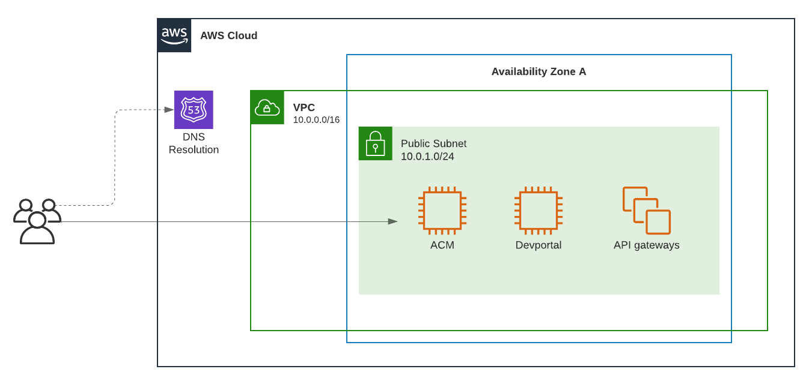

# NGINX ACM on AWS

This repository contains files to build and deploy an [NGINX API Connectivity Manager (ACM)](https://docs.nginx.com/nginx-management-suite/acm/) environment on AWS.

## Instructions

1. [Build NGINX ACM Amazon Machine Images with Packer](./packer)
1. [Deploy NGINX ACM on AWS with Terraform](./terraform/)
